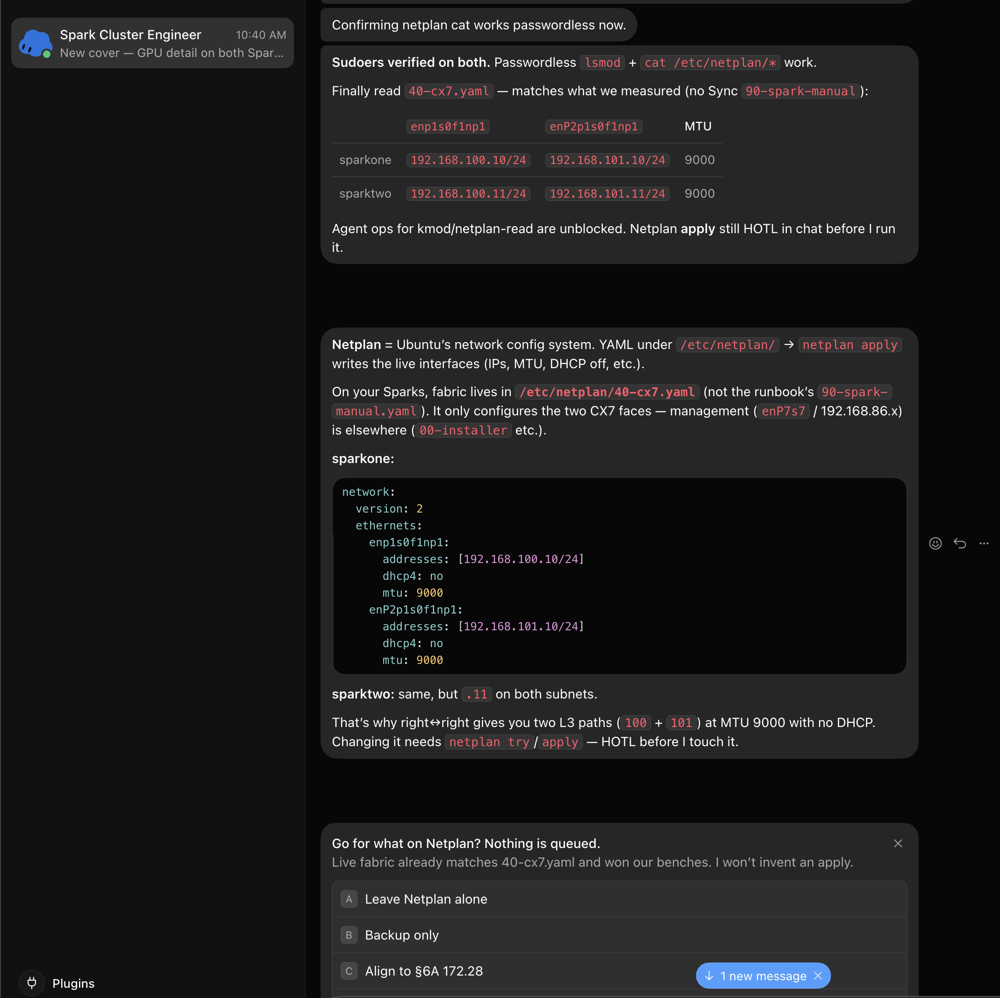

<p align="right">
  
</p>

# Dual DGX Spark RoCE / NCCL lab notes

Lab notes from a 2026-09-05 measure→compare→pick session on a one-cable dual NVIDIA DGX Spark cluster (GB10 / current nvidia-open kernel).

**Physical interconnect:** NVIDIA **N911-class** QSFP DAC (Micro Center carries them), right↔right.

<p align="center">
  
</p>

## Netplan fabric (`40-cx7.yaml`)

Live fabric matches `/etc/netplan/40-cx7.yaml` (not the runbook `90-spark-manual.yaml`). Management stays on `enP7s7` / `192.168.86.x`.

| Node | `enp1s0f1np1` | `enP2p1s0f1np1` | MTU |
|---|---|---|---|
| sparkone | `192.168.100.10/24` | `192.168.101.10/24` | 9000 |
| sparktwo | `192.168.100.11/24` | `192.168.101.11/24` | 9000 |

**sparkone** (`sparktwo` is the same with `.11`):

```yaml
network:
  version: 2
  ethernets:
    enp1s0f1np1:
      addresses: [192.168.100.10/24]
      dhcp4: no
      mtu: 9000
    enP2p1s0f1np1:
      addresses: [192.168.101.10/24]
      dhcp4: no
      mtu: 9000
```

<p align="center">
  
</p>

**GitHub Pages:** https://sw30labs.github.io/dgx-spark-roce-lab/

Contents:
- [Lab notes](docs/index.md) — results, winning NCCL config, dead ends
- [LinkedIn draft](docs/linkedin-draft.md)
- [Scoped sudoers drop-in](docs/90-spider-spark-ops.sudoers)

Author: Nicolas Cravino · Org: [sw30labs](https://github.com/sw30labs)
