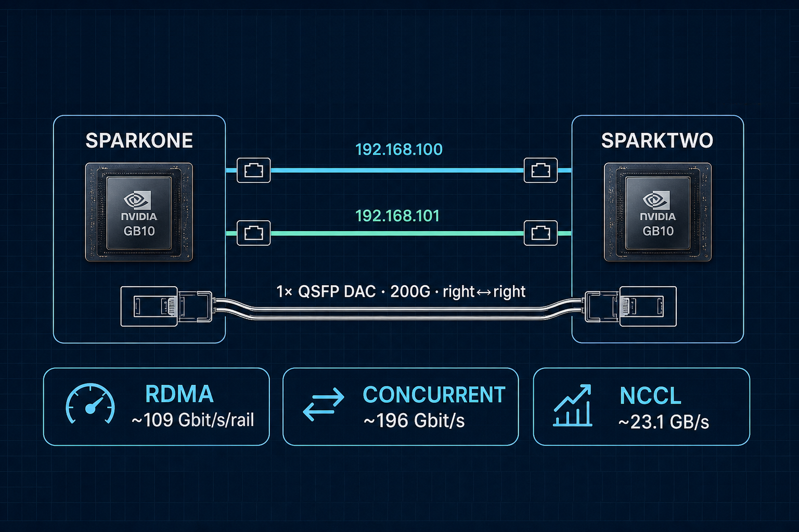

  

# Dual DGX Spark RoCE / NCCL lab notes

Lab notes from a 2026-09-05 measure→compare→pick session on a one-cable dual NVIDIA DGX Spark cluster (GB10 / current nvidia-open kernel).

**Physical interconnect:** NVIDIA **N911-class** QSFP DAC (Micro Center carries them), right↔right.

  

**GitHub Pages:** https://sw30labs.github.io/dgx-spark-roce-lab/

Contents:
- [Lab notes](docs/index.md) — results, winning NCCL config, dead ends
- [LinkedIn draft](docs/linkedin-draft.md)
- [Scoped sudoers drop-in](docs/90-spider-spark-ops.sudoers)

Author: Nicolas Cravino · Org: [sw30labs](https://github.com/sw30labs)
